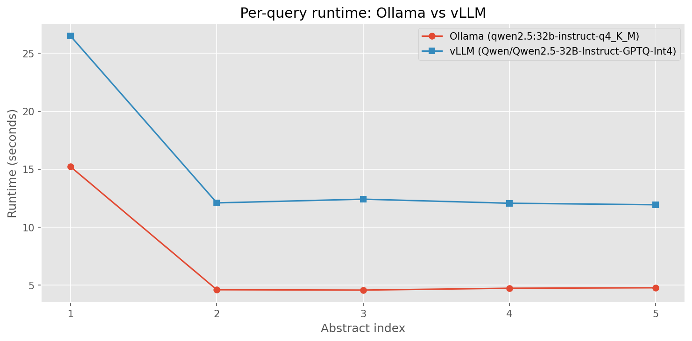

# Speed comparison: Ollama vs vLLM

## Research Question

Is vLLM faster than Ollama for sequential structured paper classification
using comparable 4-bit quantized models?

## Method

We compare two serving backends for the same classification task:

- **Ollama**: Uses the native `/api/chat` endpoint with the `format` parameter
  for JSON Schema enforcement via GBNF grammar constraints. Model weights are
  in GGUF format with Q4_K_M quantization.
- **vLLM**: Uses the OpenAI-compatible `/v1/chat/completions` endpoint with
  `guided_json` for constrained decoding. Model weights are in GPTQ-Int4
  format. Prefix caching is enabled (`--enable-prefix-caching`).

Both backends receive the identical system prompt, user message, and JSON
schema. The only differences are the serving engine and quantization format
(GGUF Q4_K_M vs GPTQ-Int4 — both 4-bit).

## Experimental Setting

| Parameter            | Ollama                        | vLLM                                  |
|----------------------|-------------------------------|---------------------------------------|
| Model                | `qwen2.5:32b-instruct-q4_K_M` | `Qwen/Qwen2.5-32B-Instruct-GPTQ-Int4` |
| Quantization         | GGUF Q4_K_M                   | GPTQ-Int4                             |
| Structured output    | `format` (GBNF grammar)       | `guided_json` (outlines/xgrammar)     |
| Prefix caching       | implicit                      | `--enable-prefix-caching`             |
| GPU(s)               | 0                        | 0                                |
| Prompt version       | `v3`                   | `v3`                           |
| Method               | `with_schema`                    | `with_schema`                            |
| Temperature          | 0.0                 | 0.0                         |
| Number of abstracts  | 5                       | 5                               |
| Execution order      | vLLM first, then Ollama       | —                                     |

## Results

### Per-query runtime

### Summary statistics

| Backend                                    |   Mean time (s) |   Median time (s) |   Total time (s) |   Mean prompt tok. |   Mean compl. tok. |   Total prompt tok. |   Total compl. tok. |
|:-------------------------------------------|----------------:|------------------:|-----------------:|-------------------:|-------------------:|--------------------:|--------------------:|
| Ollama (qwen2.5:32b-instruct-q4_K_M)       |            6.79 |              4.74 |            33.93 |                446 |                106 |                2231 |                 530 |
| vLLM (Qwen/Qwen2.5-32B-Instruct-GPTQ-Int4) |           15    |             12.1  |            75.02 |                446 |                 95 |                2231 |                 474 |

### Model setup time

| Backend | Setup time (s) |
|---------|---------------|
| Ollama  | 0.22 |
| vLLM    | 81.17 |

Ollama setup time measures `ensure_model()` (check if model exists, pull if needed).
vLLM setup time measures server startup until the `/health` endpoint responds
(includes model loading, KV cache allocation, and engine initialization).

### Key observations

- Mean speedup (vLLM / Ollama): **0.45x**

## Conclusion

Both backends show comparable performance for sequential structured classification, with a speedup factor of 0.45x across 5 abstracts. At this batch size and sequential execution pattern, the serving overhead differences are minimal.
