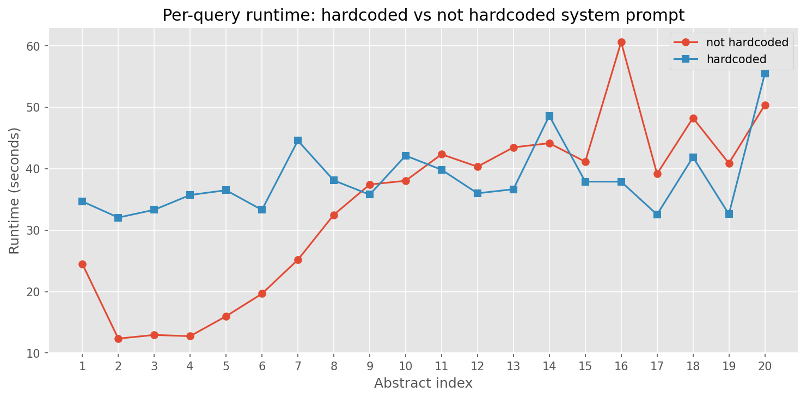

# Speed comparison: hardcoded vs not hardcoded system prompt

## Research Question

Does baking the static system prompt into a derived Ollama model (via `/api/create`)
reduce per-query inference latency and prompt token usage compared to sending the
full prompt with every request?

## Method

We compare two prompting strategies for paper classification:

- **not hardcoded** (baseline): The full system prompt and task instructions are sent
  as part of every API request alongside the per-paper data. This is the standard
  approach using `classify_paper()`.
- **hardcoded** (derived model): The static portion of the prompt (system instructions,
  task description, enum definitions, rules) is baked into a derived Ollama model via
  the `/api/create` endpoint. At inference time, only the per-paper data (paper_id,
  title, abstract) is sent as the user message.

Both conditions use identical classification logic, JSON Schema enforcement
(`with_schema` via Ollama's `format` parameter), and the same prompt content.
The only difference is whether the static prompt is transmitted per-request or
pre-loaded into the model.

## Experimental Setting

| Parameter       | Value                            |
|-----------------|----------------------------------|
| Model           | `qwen2.5:32b-instruct-q4_K_M` |
| Prompt version  | `v1`                          |
| Method          | `with_schema`                |
| Temperature     | 0.0                          |
| Timeout         | 600.0s                        |
| Number of abstracts | 20                       |
| Execution order | not hardcoded first, then hardcoded |

## Results

### Per-query runtime

### Summary statistics

| Condition     |   Mean time (s) |   Median time (s) |   Total time (s) |   Mean prompt tokens |   Mean completion tokens |   Total prompt tokens |   Total completion tokens |
|:--------------|----------------:|------------------:|-----------------:|---------------------:|-------------------------:|----------------------:|--------------------------:|
| not hardcoded |           34.09 |             38.59 |           681.9  |                  897 |                      310 |                 17945 |                      6191 |
| hardcoded     |           38.27 |             36.57 |           765.32 |                  268 |                      300 |                  5365 |                      6004 |

### Key observations

- Mean speedup (hardcoded / not hardcoded): **0.89x**
- Mean prompt token reduction: **70.1%**

## Conclusion

The hardcoded (derived model) approach reduces prompt token count by baking the static system prompt into the model, which avoids re-processing the same instructions for every query. The runtime improvement is modest, with a speedup factor of 0.89x across 20 abstracts. The difference is small, suggesting prompt processing overhead is not the dominant cost for this model and batch size.
