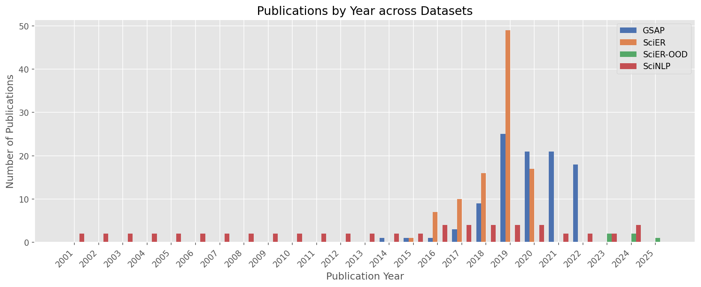

# Publication Metadata Report

Overview of publication years across the four datasets used in
the UnifiedSciERE project. Metadata was collected from arXiv
(GSAP), Semantic Scholar (SciER, SciER-OOD), and the ACL
Anthology (SciNLP).

## Dataset Summary

| Dataset | Papers | Year Range | Source |
|---------|-------:|------------|--------|
| GSAP | 100 | 2014--2022 | arXiv |
| SciER | 100 | 2015--2020 | Semantic Scholar |
| SciER-OOD | 5 | 2023--2025 | Semantic Scholar |
| SciNLP | 60 | 2001--2024 | ACL Anthology |

### Abstract Availability

| Dataset | Papers | With Abstract | Without Abstract | Coverage |
|---------|-------:|--------------:|-----------------:|---------:|
| GSAP | 100 | 100 | 0 | 100% |
| SciER | 100 | 100 | 0 | 100% |
| SciER-OOD | 5 | 3 | 2 | 60% |
| SciNLP | 60 | 60 | 0 | 100% |

### Identifier Coverage

| Dataset | Papers | OpenAlex | arXiv | Semantic Scholar | DOI |
|---------|-------:|---------:|------:|----------------:|----:|
| GSAP | 100 | 99 (99%) | 100 (100%) | 0 (0%) | 58 (58%) |
| SciER | 100 | 100 (100%) | 94 (94%) | 100 (100%) | 72 (72%) |
| SciER-OOD | 5 | 5 (100%) | 4 (80%) | 0 (0%) | 5 (100%) |
| SciNLP | 60 | 60 (100%) | 18 (30%) | 0 (0%) | 46 (76%) |

### GSAP Selection Breakdown

GSAP documents are drawn from two sources, identified by the
`doc_id` prefix:

| Selection | Papers |
|-----------|-------:|
| huggingface_selection | 50 |
| arxiv_random_selection | 50 |

## Publications by Year

The chart shows the number of publications per year for each
dataset. Bars are grouped (not stacked) to allow direct
comparison.

Key observations:

- **GSAP**: 100 papers, most frequent year 2019 (25 papers).
- **SciER**: 100 papers, most frequent year 2019 (49 papers).
- **SciER-OOD**: 5 papers, most frequent year 2023 (2 papers).
- **SciNLP**: 60 papers, most frequent year 2016 (4 papers).
